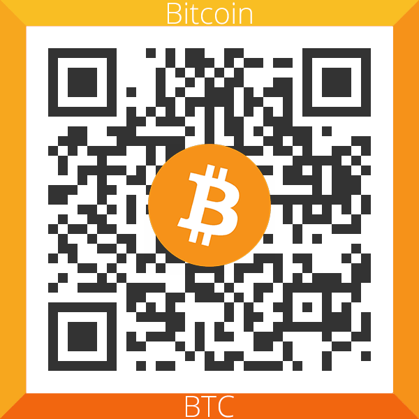
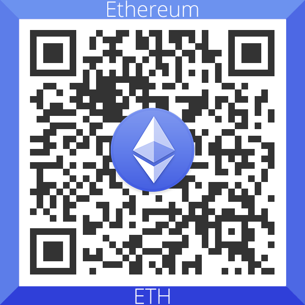
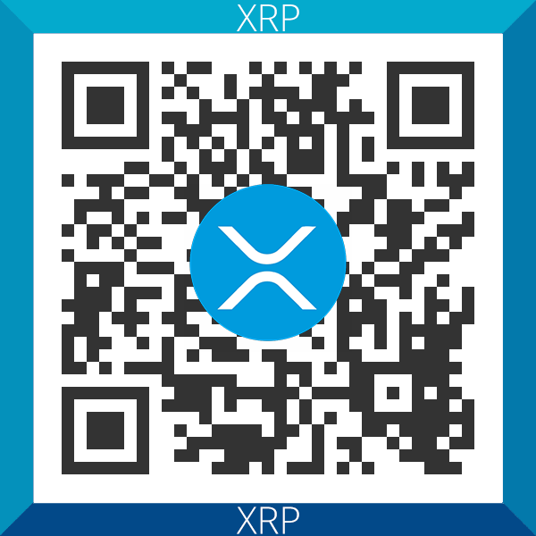

# pornky.com addon for Kodi

_based on 'Simple example plugin for Kodi mediacenter'_

## License
- [GPLv3](http://www.gnu.org/copyleft/gpl.html)

## Donate

- Bitcoin (BTC): 1BDpCYE2x1TbXzk1VjVeg11wsBKqKGrmKL
- Ethereum (ETH): 0xbb12d359681C1Ce43fc0552723ACF98673ee1124
- Ripple (XRP): rwu4XmSLDULFp5FshrtRi8r5gNCfPMwa25





## Supported and tested Kodi versions
- 16.1 (tested)
- 17.6 (tested)
- 18.8 (tested)

## Third party software and other assets

### fanart.jpg
- based on 'Photo by Dainis Graveris from Pexels'
- https://www.pexels.com/photo/red-bikini-love-legs-3827430/

### icon.png
- based on fonts
  - Cantarell
  - DejaVu Sans

### enum34
- the enum module from Python3.4 backported from 3.3 - 2.4
- https://bitbucket.org/stoneleaf/enum34/src/default/

```
Copyright (c) 2013, Ethan Furman.
All rights reserved.

Redistribution and use in source and binary forms, with or without
modification, are permitted provided that the following conditions
are met:

    Redistributions of source code must retain the above
    copyright notice, this list of conditions and the
    following disclaimer.

    Redistributions in binary form must reproduce the above
    copyright notice, this list of conditions and the following
    disclaimer in the documentation and/or other materials
    provided with the distribution.

    Neither the name Ethan Furman nor the names of any
    contributors may be used to endorse or promote products
    derived from this software without specific prior written
    permission.

THIS SOFTWARE IS PROVIDED BY THE COPYRIGHT HOLDERS AND CONTRIBUTORS "AS IS"
AND ANY EXPRESS OR IMPLIED WARRANTIES, INCLUDING, BUT NOT LIMITED TO, THE
IMPLIED WARRANTIES OF MERCHANTABILITY AND FITNESS FOR A PARTICULAR PURPOSE
ARE DISCLAIMED. IN NO EVENT SHALL THE COPYRIGHT HOLDER OR CONTRIBUTORS BE
LIABLE FOR ANY DIRECT, INDIRECT, INCIDENTAL, SPECIAL, EXEMPLARY, OR
CONSEQUENTIAL DAMAGES (INCLUDING, BUT NOT LIMITED TO, PROCUREMENT OF
SUBSTITUTE GOODS OR SERVICES; LOSS OF USE, DATA, OR PROFITS; OR BUSINESS
INTERRUPTION) HOWEVER CAUSED AND ON ANY THEORY OF LIABILITY, WHETHER IN
CONTRACT, STRICT LIABILITY, OR TORT (INCLUDING NEGLIGENCE OR OTHERWISE)
ARISING IN ANY WAY OUT OF THE USE OF THIS SOFTWARE, EVEN IF ADVISED OF THE
POSSIBILITY OF SUCH DAMAGE.
```